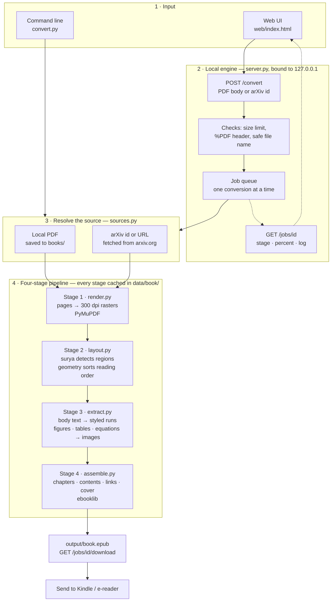
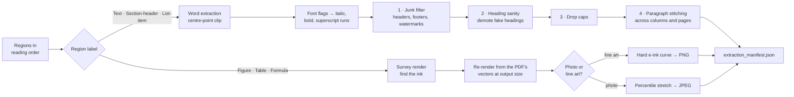
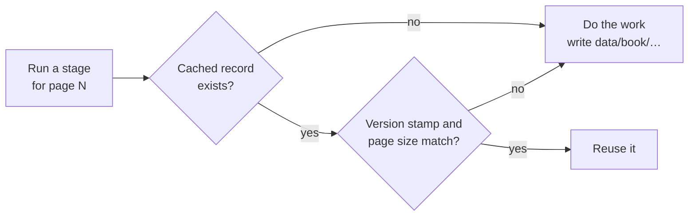

# Paper to EPUB

Convert academic papers — multi-column, equation- and figure-heavy — into EPUBs
that actually read well on a Kindle, Kobo or other e-ink device.

Runs entirely on your own machine. Nothing is uploaded anywhere.

```bash
docker compose up engine     # then open http://localhost:8765
```

---

## Why this exists

A two-column A4 paper on a 6-inch screen is unreadable: you pan around a page
built for a sheet four times the size. Converting it to a reflowable format is
the fix, and general PDF-to-EPUB converters make a mess of it for two reasons.

They **linearise the columns** — a PDF stores text in whatever order the
typesetter emitted it, so read naively a two-column page interleaves both
columns line by line. And they **try to turn equations into text**, which
produces things like `min ϕ∈B max Px,s∈Ux,s Tr Ex,s[ϕ(x) −s][ϕ(x) −s]H`.

This converter refuses the second one outright:

> **Body text becomes text. Every figure, table, plot and equation becomes an
> image, rendered from the PDF and never parsed.**

You give up selectable equations. You get equations that are correct.

## What you get

- **Layout-aware reading order** — regions are detected on each page and sorted
  by a column-aware pass: left column top to bottom, then right, banded around
  anything full-width.
- **Paragraphs that survive the columns** — a paragraph torn across a column or
  page break is re-joined. On the test corpus this took paragraphs left cut
  mid-sentence from 60% to 14%.
- **Equations rendered, not photographed** — figures and formulas are rendered
  from the PDF's own vector source at the size they ship at, so text inside a
  plot stays type instead of resampled pixels.
- **Emphasis preserved** — italics, bold and superscripts are read from the
  PDF's font metadata. Species names and variables come through as italics.
- **Images sized for the device** — every crop is trimmed to its ink, sized for
  the target panel, greyscaled, and encoded as PNG for line art or JPEG for
  photographs. Figures fill the screen; equations keep their printed scale.
- **Contrast that suits the content** — the hard e-ink curve that makes a
  formula crisp flattens a photograph, so the two are treated separately.
- **Real structure** — one chapter per top-level section, subsections nested in
  the table of contents, tappable citations and cross-references, generated
  cover.
- **Chrome stripped** — running headers, footers, page numbers, watermarks and
  publisher badges.
- **Resumable** — every stage caches to disk, so an interrupted run picks up
  where it left off and re-running is cheap.

## Quick start

### With Docker

Nothing to install but Docker itself.

```bash
docker compose build
docker compose up engine
```

Open <http://localhost:8765>, drop a PDF or paste an arXiv link, download the
EPUB. Finished files also appear in `output/`.

Prefer the command line?

```bash
docker compose run --rm pdf2epub mypaper          # books/mypaper.pdf
docker compose run --rm pdf2epub 2401.12345       # an arXiv ID or URL
docker compose run --rm pdf2epub                  # everything in books/
```

### With Python 3.11

```bash
pip install torch==2.11.0 --index-url https://download.pytorch.org/whl/cpu
pip install -r requirements.lock.txt

python server.py           # http://localhost:8765
python convert.py mypaper  # or straight to the command line
```

`surya-ocr` is pinned to `0.6.0` on purpose — later releases change the API this
is built around.

> **First run** downloads the layout model (about 1 GB) and caches it. After
> that the converter works offline. Expect several minutes for a paper the first
> time: detecting the layout is the slow stage, and it is cached per paper.

## Getting it onto a Kindle

Use [Send to Kindle](https://www.amazon.com/sendtokindle) — email, the web
uploader, or the desktop app. Amazon converts the EPUB to its own format on the
way in. Copying an EPUB over USB is the unreliable path: some firmware handles
it, some silently ignores the file.

Because that conversion drops most of what a browser would honour, the
stylesheet here is deliberately short. See [docs/KINDLE.md](docs/KINDLE.md).

## Reading on a different device

Defaults target a 6-inch Kindle: 1072 × 1448, 300 PPI, sixteen levels of grey.
For anything else, change these together in `config.py`:

```python
DEVICE_SCREEN_PX    = (1072, 1448)   # Paperwhite: (1264, 1680)
IMAGE_MAX_WIDTH_PX  = 1200
IMAGE_MAX_HEIGHT_PX = 1600
IMAGE_GRAYSCALE     = True           # False for a colour reader
```

## How it works

### Behind the scenes, end to end



### Stage 3 in detail — where the quality comes from



### Caching



Each stage writes to `data/<book>/` and skips work already done. Caches carry a
version stamp and the page dimensions, so changing the resolution or the format
regenerates what it has to and nothing else. Cleanup is never cached: it runs on
every load, so a new junk pattern takes effect on the next run.

| Stage | File | Library | Writes |
|---|---|---|---|
| 1 · Render | `render.py` | PyMuPDF | `pages/page_NNNN.png`, `manifest.json` |
| 2 · Layout | `layout.py` | surya 0.6.0 + geometry | `layout/page_NNNN.json` |
| 3 · Extract | `extract.py` | PyMuPDF + Pillow | `extraction/…`, `regions/*.png\|.jpg` |
| 4 · Assemble | `assemble.py` | ebooklib | `output/<book>.epub` |

Full detail in [docs/ARCHITECTURE.md](docs/ARCHITECTURE.md).

## The HTTP engine

`server.py` wraps the pipeline in a small HTTP server bound to loopback, and
serves the web UI. It is also a plain API:

| Endpoint | |
|---|---|
| `GET /` | the web UI |
| `GET /health` | engine status, queue depth |
| `POST /convert` | raw PDF body with `X-Filename`, or JSON `{"arxiv": "2401.12345"}` |
| `GET /jobs/<id>` | status, stage, percent, log tail |
| `GET /jobs/<id>/download` | the finished EPUB |

One conversion runs at a time — the layout model wants the whole machine.

Run directly, it binds `127.0.0.1`. Under `docker compose` it binds `0.0.0.0`
inside the container, because a container-local `127.0.0.1` would be unreachable
from the host; the published port then pins it to the host's `127.0.0.1`, so the
engine stays reachable only from this machine.

Two things reach the network, both on purpose: the layout model downloads from
Hugging Face on first run, and an arXiv request fetches that paper. A local PDF
never leaves the machine.

## Project layout

```
books/            input PDFs
output/           finished EPUBs
data/             intermediate renders, layout, crops
config.py         every setting, in one place
convert.py        the command line; runs the four stages
render.py         stage 1 — PDF to page rasters
layout.py         stage 2 — regions and reading order
extract.py        stage 3 — text, images, and every cleanup pass
assemble.py       stage 4 — the EPUB itself
cache.py          when a stage's cached work is still valid
progress.py       progress the terminal and the engine both read
sources.py        local files, arXiv ids, URLs
cover.py          generated cover
server.py         HTTP engine + web UI
web/index.html    the UI
junk_patterns.txt extra publisher boilerplate to strip
tests/            unit tests for the cleanup logic
```

## Development

```bash
python -m unittest discover -s tests    # fast, no PDF or model needed

python extract.py mypaper               # re-run extraction + cleanup only
python assemble.py mypaper              # re-assemble only
```

Cleanup runs on every load rather than being cached, so tuning a junk pattern or
a stitching rule takes effect on the next run without a full re-extract.

## License

All rights reserved — see [LICENSE](LICENSE). The source is published for
reading only; using, copying, modifying or redistributing it requires written
permission.

Built for reading papers on a 6-inch Kindle, because nothing else did it
properly. If it saves you some eye strain, that was the point.
